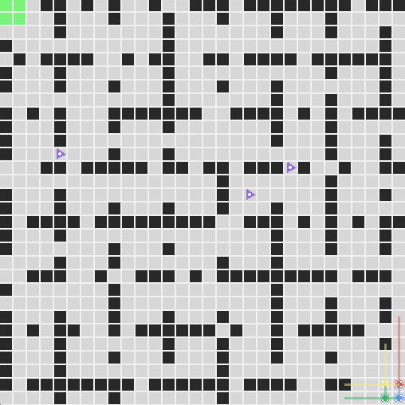
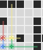
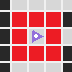

# Hackathon : Reinforcement Learning for Drone Navigation

*Your task is to develop a Reinforcement Learning (RL) algorithm to teach drones how to autonomously navigate a grid environment, reaching their objective as quickly as possible while avoiding obstacles. The environment includes walls and dynamic obstacles, which the drones must avoid to successfully complete their mission.*



## 🌍 Project overview

This toolkit provides a simulated environment where your drones must navigate. The goal is for your drones to take optimal actions to reach their target swiftly while avoiding collisions with dynamic obstacles. The environment consists of walls and moving obstacles which can change positions every step.

This guide will walk you through the steps to get started, helping you use the provided toolkit to build and train your agent. The toolkit includes the following files:
- `requirements.txt` - lists the libraries and dependencies required to run the project;
- `teamname_hackathon.ipynb` - notebook to train and test your agent;
- `simulate.py` - runs simulation episodes either for train or for test;
- `env.py` - contains the environment setup and configuration;
- `agent.py` - contains the agent's policy and action selection logic;
- `reward.py` - contains the reward calculation function;
- `config.json` - configuration file for modifying environment and drone parameters.

## 📚 Prerequisites

Before you begin, ensure you have installed the necessary dependencies by running:
```bash
pip install -r requirements.txt
```

## ⚡ Quickstart

The `teamname_hackathon.ipynb` file is divided in two main sections:
- *1. Training*: the first cell will allow you to quickly run simulations for training within the environment using te parameters set in `config.json`. In the current implementation, the **agent's actions are selected randomly**, providing you with a reference model (i.e., no learning is applied).
- *2. Evaluation*: this section allows you to run tests with a fixed trained agent for multiple configuration and save the results in a `csv` file.

You can interrupt the simulation at any time using `Ctrl+C`.


## 🤖 Agents

The drones represent the agents in the environment. At each step, each agent must choose one of the following actions:
- stay steady;
- move forward;
- move backward;
- move left;
- move right;
- turn right;
- turn left.

Each agent is equipped with a LIDAR system (translucent beams) that scans its surroundings within a specified range:
- the main LIDAR scans in front of the agent with a longer range defined by `max_lidar_dist_main` in the `config.json`;
- the secondary LIDARs scan to the left and right, with a shorter range defined by `max_lidar_dist_second` in the `config.json`.

 

The agent retrieves the following `state` at each step:
- its own position and orientation (x, y, o);
- its status (0: still running, 1: evacuated, 2: deactivated);
- the position of its goal (x, y);
- the LIDAR data in the 3 directions (main, right, left):
    - the distance to the nearest obstacle (or the maximum LIDAR range if no obstacle is present);
    - the type of obstacle detected (0: no obstacle, 1: wall or grid boundary, 2: dynamic obstacle, 3: another agent).
- for each agent within the communication range:
    - their position and orientation;
    - their status;
    - their LIDAR data.

This state can be used as is for the policy and action selection but you can also modify it by combining informations or whatever. However, you cannot add informations that are not included in those observations.


Your goal is to build your own agent by modifying the class `MyAgent()` in the `agent.py` file. We recommand you to build inside this class the methods required to select an action like `get_action()` and to update the selection policy like `update_policy()`. 

For faster iterations or slower iterations, you can choose the `time.sleep()` between each iterations by changing the values in `simulate.py`: if you set `time.sleep(0)`, it will be instantaneous. The first time sleep in the functions `train()` and `evaluate()` is dedicated to the setup of the environment, and the second one is dedicated to the episode steps. 
To train without rendering which can slow down your iterations, you can put `render_mode=None` in the `config.json`.


## 🏙️ Environnement

The environment is defined in `env.py` generated semi-randomly using a seed. There are no restrictions on the environments to use during the training phase.

### **Starting Position and Goal Position**

Drones start in one of the four corners of the grid. The goal is always located in the opposite corner of the grid, marked by a green area. Drones must navigate to this goal.


### **Obstacles**

**Walls** are randomly generated in each simulation as black squares. Collisions with walls deactivate the drones.

**Dynamic obstacles** are randomly generated as purple triangles, always located outside the start and goal zones. They can move in any of four directions or stay stationary each step. If any agent comes within a cell of a dynamic obstacle, it is deactivated.




## ⚙️ Configuration

To train your agents and optimize their learning, you can modify the configuration parameters in the `config.json` file. The following parameters are available:
- `grid_size`: size of the environment grid;
- `walls_proportion`: proportion of walls inside the grid;
- `num_dynamic_obstacles`: number of dynamic obstacles;
- `num_agents`: number of drones;
- `communication_range`: maximum distance for communication between drones;
- `max_lidar_dist_main`: maximum range of the main LIDAR;
- `max_lidar_dist_second`: maximum range of the secondary LIDAR;
- `max_episodes`: maximum number of episodes before reset;
- `max_episodes_steps`: maximum number of steps per episode;
- `render_mode` (optional): rendering mode for Pygame (`"human"`) if `None`, no rendering;
- `seed` (optional): seed for fixed environment.

Refer to the *Evaluation* section for further details on evaluation configurations.


## 🎁 Reward

The reward function, located in `reward.py`, is used to provide feedback to agents based on their actions. The current implementation is basic but can be modified to improve learning. Here's how the current reward system works:
- a deactivated agent (due to a collision) receives a penalty of -100;
- an agent that reaches the goal receives a reward of +1000;
- for all other agents, a penalty of -0.1 per step is applied.

You are encouraged to modify this function to create a more optimal reward system to enhance your agent's learning performance.


## ✒️ Evaluation

On the 7th day of the hackathon at 00:01 AM, we will provide a folder with 10 evaluation configurations, such as `"eval_configs/config_1.json"`. You must run the section *2. Evaluation* of the `teamname_hackathon.ipynb` notebook to test your agent's performance on these configurations. 

Please rename the notebook with your team name and update the first cell with your team members' names.

### Deliverables
Before the end of the 7th day (11:59 PM), submit the following files in a `.zip` archive to contact.hackathon-ai.ah@airbus.com:
- `teamname_hackathon.ipynb` already ran with the outputs and notebook checkpoints;
- `agent.py` containing the updated action selection and policy functions;
- `reward.py` containing the updated reward function `compute_reward()`;
- `simulate.py` if any modification were made to `train()`;
- `reward_curve_per_episode.png` automatically generated by `train()`;
- `all_results.csv` automatically generated by the `evaluate()`;
- `averages.csv` generated by *2. Evaluation*;
- `README.md` documenting your code, modifications and training process;
- A 2-minutes video where you introduce your team and showcasing the solution you designed for a non-expert audience.

If the file size is too large to email, you may provide a WeTransfer link.

### Evaluation criteria
Your performance will be evaluated on the following:
- **75%** Performance accross 10 test evaluation environment (identical for all teams) with varying difficulty levels. Metrics recorded during 10 trials per environment include:
    - Number of steps
    - Cumulated rewards
    - Number of evacuated agents
    - Number of deactivated agents
    
  Objective: maximize the number of successfully evacuated agents, minimize deactivated agents, and complete tasks in the fewest steps possible. You will not know the test environment configuration before the last day and we ask you to not retrain your agents on those configuration. We will control if any doubt by retraining any agents following your training process. However, we provide you the range within which the parameters for these environments will be fixed:
    - `grid_size`: 10 to 30;
    - `walls_proportion`: 0.1 to 0.6;
    - `num_dynamic_obstacles`: 0 to 5;
    - `num_agents`: 4;
    - `communication_range`: 5 to 10;
    - `max_lidar_dist_main`: 5;
    - `max_lidar_dist_second`: 1 to 3.
- **5%** Reward function: the reward function should be well-designed and relevant to the task.
- **20%** Learning curve & strategy: the `train()` function will automatically generate `reward_curve_per_episode.png` displaying the reward curve over episodes. The most efficient learning agents will be rewarded, i.e. the ones that require fewer episodes to converge or reach an optimal state.


## 🏁 Good Luck!
We hope this will help you get started on your one-week journey to build intelligent drone navigation agent. Be creative with your approach, experiment with different algorithms, and don’t forget to have fun!

Feel free to reach out if you have any questions or need assistance during the hackathon at contact.hackathon-ai.ah@airbus.com

Happy coding! 🤖