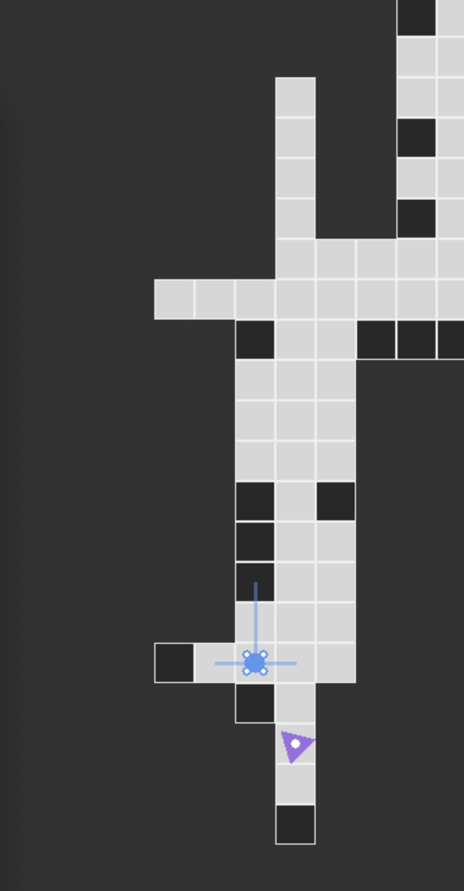
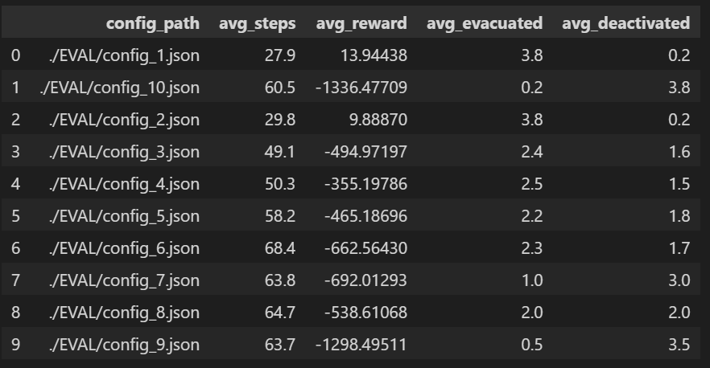
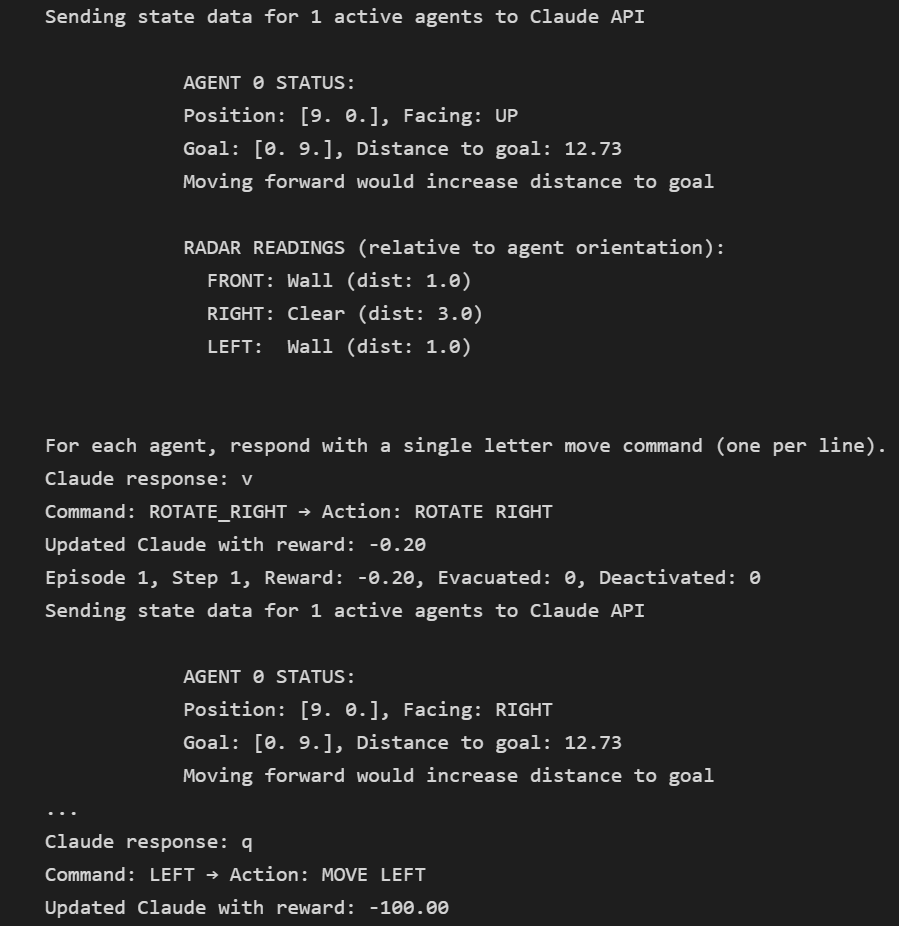
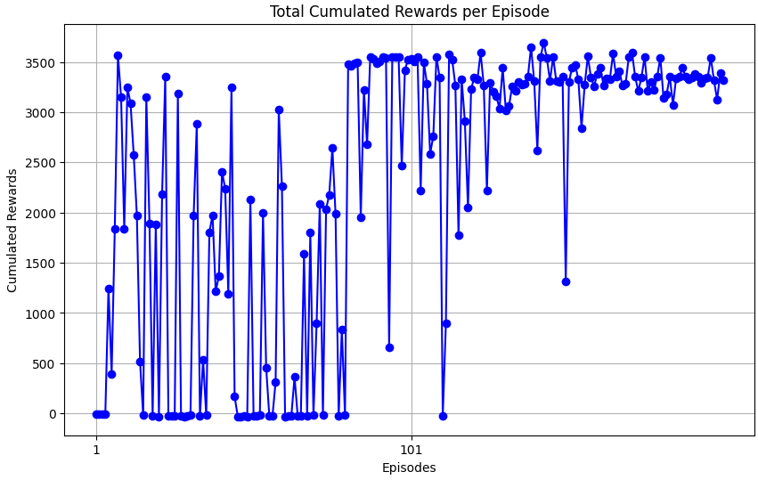

# Drone Swarm Labyrinth RL: A Week of Exploration

## I. Deterministic Approch

Since we did not have a previous experience with solving this type of game, we endeavour to better understand it. We re-coded a controllable game entirely. It enabled us to discover what agents perceive about the grid, at each step, and develop some experience about the task. Mainly, we discovered that even if the game looks easy, humans could not win most of the times in the harder config.

We decided first to solve the task with a deterministic algorithm. Our solution combines 4 key elements:

* Memory mapping: each agent builds its own memory map of the environment as it explores
* Collaborative intelligence: Agents share their observations within communication range (ONLY instant t information and ONLY when they are in range)
* A* pathfinding: a classic search algorithm that guarantees optimal paths
* Fallback strategies

### Mapping

Each agent maintains its own memory map of the environment, which starts mostly unknown (-1) and gets updated as the agent explores:

* -1: Unknown areas
* 0: Free space
* 1: Walls
* 2: Dynamic obstacles
* 3: Other agents
* 4: Goal location

The agents progressively build this map through:

* Their own LIDAR observations
* Information shared by other agents within communication range

The system tracks "danger zones" around dynamic obstacles: When a dynamic obstacle is detected, the surrounding cells are marked as dangerous. The pathfinding algorithms avoid these danger zones when possible. This creates a safety buffer around moving obstacles

### What is A*?

A* is like a smart GPS for grid environments. Here's how it works in simple terms:

* Imagine you're in a maze trying to find the exit
* At each intersection, A* evaluates all possible paths based on:

  * How far you've already traveled from your starting point
  * How far you estimate you are from the goal using Manhatthan distance
  * Some eventual cost you gave to the case.

* A* always explores the most promising path first. It maintains a list of intersections to visit, always prioritizing the most promising one in terms of Manhattan distance to the goal
* Once the goal is reached, it traces back the optimal path

A* make sure to find the shortest path when one exists (in general it is performing better than other approaches such as breadth-first search).

When the standard A* can't find a path (due to unknown areas or obstacles), we implemented 2 fallback strategies:

* a_star_allow_unknown: A modified A* that applies penalties to unknown or dangerous cells rather than avoiding them completely
* greedy_path: A simple greedy approach that always moves toward the goal, used as a last resort

Finally, several mechanisms prevent agents from getting stuck:

* stuck_counter: Tracks how long an agent stays in the same position
* action_repeat_counter: Tracks how many times the same action is repeated
* Random actions are taken if stagnation is detected

**Process :**

For each step, the agent:

1. Updates its memory based on current observations and shared information
2. Checks if it has reached the goal
3. Calculates a path to the goal using A* (with fallbacks)
4. Determines the next action based on:
    * The next position in the calculated path
    * The current orientation (may need to rotate first)
5. Applies anti-stagnation checks to avoid getting stuck
6. Executes the selected action

=> You can find the Notebook implementation called EvaluationAStar.ipynb. Here are the results :

## II. LLM Player Approach

In an other creative strike we developed an LLM-powered agent. The implementation used a detailed prompt describing the agent's surroundings, goal position, and LIDAR readings, enabling our LLMAgent to make informed decisions about movement actions. This approach proved remarkably effective, for smaller smaller config effortlessly solving 10×10 grids even with multiple agents navigating simultaneously. However, this success came with practical drawbacks: API calls introduced significant latency between actions, and the financial cost implications of frequent API calls made this approach expensive.

## III. Our Reinforcement Learning Journey**

Considering the problem caracteristics in particular the fact that this is a multi agent environment with discrete action space. We choose to explore the QMIX algorithm.

QMIX is a value-based multi-agent reinforcement learning algorithm designed to handle the challenges of decentralized execution with centralized training. It works by learning individual Q-values for each agent while using a mixing network to combine these values into a joint team Q-value. The beauty of QMIX is its monotonicity constraint - it ensures that if an individual agent's action improves its local Q-value, it also improves the team's Q-value, allowing for decentralized execution.

### 1. Designing the best reward function

After some trial and error, and some overly sophisticated approach (using A* algo, using penalty for specific action or pattern of action... ), we have ultimately settled on a reward function with the following key componant:

* **Goal Achievement**: A substantial one-time reward (10,000) when an agent reaches the goal area, encouraging completion of the primary objective.
* **Deactivation Penalty**: A severe penalty (-10,000) when agents collide with obstacles or walls, strongly discouraging unsafe navigation.
* **Distance-based Guidance**: Several distance metrics help guide agents toward the goal:
    1. A general distance penalty proportional to Manhattan distance from the goal
    2. A reward for reducing distance to the goal (making progress)
    3. A scaled penalty for increasing distance from the goal (moving away)

**Time Management**: A small time penalty (-0.1) per step encourages efficiency and discourages wandering.
**Anti-laziness Mechanism**: A specific penalty (-0.5) for staying in the same position, preventing agents from getting stuck or remaining idle.

**Team Progress Reward**: When any agent reaches the goal, all active agents receive a bonus reward (5), encouraging team-oriented behavior.
**Proximity Cooperation**: Agents receive small bonuses (0.3) for staying near other agents within a threshold distance (5.0), promoting swarm cohesion without forcing tight grouping.

All rewards are ultimately normalized by a scaling factor (1000) to keep them in a manageable range for the learning algorithms.

### 2. Adding Memory with RNN Layers

When our initial QMIX implementation failed to converge, we analyzed that the problem was a Partially Observed Markov Decision Process (POMDP). In order to solve the task, we enhanced the agent's architecture with a recurrent neural network (RNN) layer : 1 then 2. The idea was to provide our agents with memory of previous states, which should theoretically help them make better decisions in partially observable environments. Despite this promising approach, our agents still wandered aimlessly, unable to find a reliable path to the goal.

### 3. State Normalization

In an attempt to simplify the learning problem, we modified the input state representation by rotating all states to a standardized orientation. This meant that from the agent's perspective, they always started in the top-left corner (0,0), with the goal consistently placed at the opposite end of the grid. We hoped this would make the learning task more consistent, but alas, our drones continued to stroll around rather than finding their path.

### 4. Success Buffer Implementation

Next came our "success buffer" approach - a specialized replay memory that prioritized storing and resampling successful episodes. The idea was to help our agents learn from their rare victories. This approach finally showed some promise! Our agents started converging... but only in empty environments without any walls. The moment we introduced complexity, they were (mostly) lost again.

### 5. Spatial Convolution Mixer

Growing more ambitious, we redesigned our architecture to use a central state representation with all spatial information encoded as a grid. We added convolution layers to our mixer network, hoping to capture spatial relationships better. Unfortunately, this sophisticated approach suffered from recurring gradient explosions that we couldn't successfully mitigate. Our beautiful neural network was learning too enthusiastically for its own good!

### 6. Behavior Cloning from A* Agent

In what felt like a stroke of genius, we used our A*-agent that could navigate the maze perfectly and tried to teach our RL agents to mimic this behavior through behavior cloning. The A* CLONED agent performed brilliantly, but unfortunately, the transfer learning to our QMIX was less than stellar.

### 7. MAPPO Approach

In desperation, we pivoted to MAPPO (Multi-Agent Proximal Policy Optimization), an actor-critic method that extends PPO to multi-agent settings. Unlike value-based methods like QMIX, MAPPO directly optimizes a policy using trust region methods, which can be more stable for complex environments. It maintains a centralized critic for value estimation while allowing decentralized actors for execution. Despite MAPPO's theoretical advantages for cooperation tasks, our implementation still failed to converge, leaving our drones as confused as ever.

Throughout this journey, our drone swarm seemed determined to prove that navigating mazes is indeed a challenging problem, even for state-of-the-art reinforcement learning algorithms!
